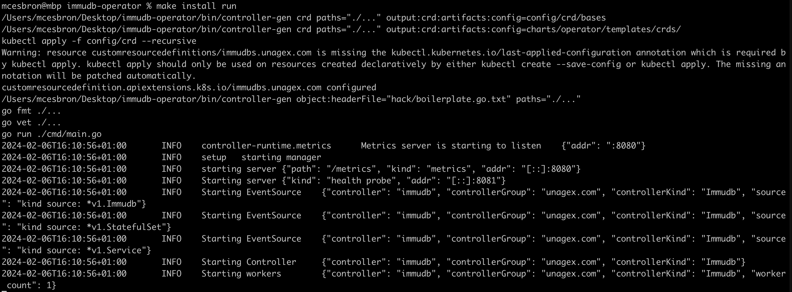

# Contribution

Thanks for taking the time to contribute to immudb-operator.

## How to make PR
You can create a PR into `main` when your feature is ready. We will review it within 2 days.

## Local development with minikube
1. To try a new feature, first create a minikube cluster.
```bash
minikube start
```
2. Clone this repository.
```bash
git clone git@github.com:unagex/immudb-operator.git
cd immudb-operator
```
3. Make your changes in the code.
4. Run the binary against the minikube cluster with the following command. There is no need to build the docker image.
```bash
make install run
```
You should see the following log:


5. The operator is now running on minikube, you can create the custom resource and see how the operator handles it.
```bash
kubectl apply -f config/samples/v1_immudb.yaml
```