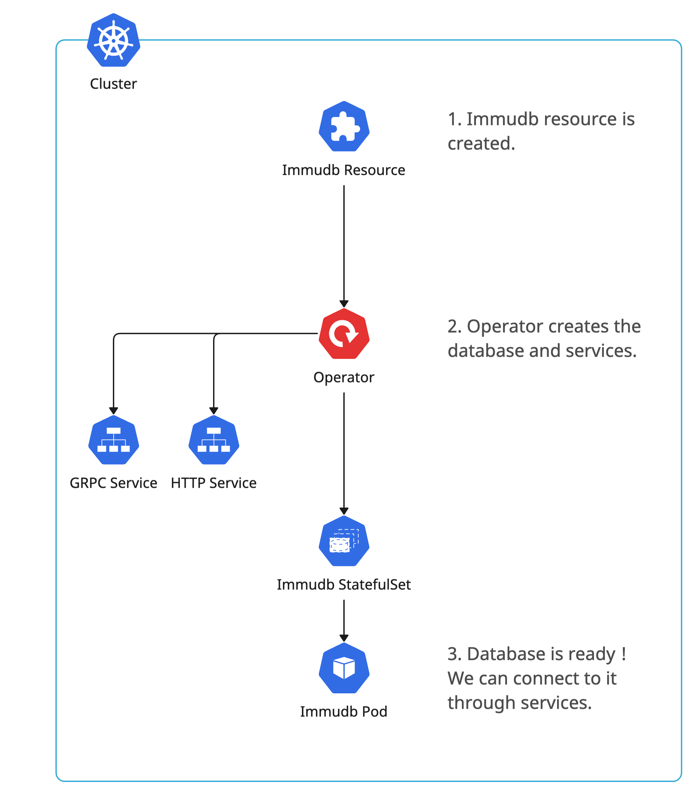

# Operator Overview
The operator watches `Immudb resources`. See the default operator behavior in the diagram below.
  

## **Pro Tips :bulb:**
1. Deleting the `immudb resource` deletes the database and all its associated resources (services, persistantVolumeClaim, ...).
2. You can create as much `immudb resources` as you want. The limit is your cluster infrastructure.
3. The operator is a `Deployment`. You can debug by checking his pod logs.
4. Check status.ready of the `immudb resource` to know when the immudb is ready to accept connections.
5. Check status.hosts of the `immudb resource` to establish a database connection with the chosen host from another `Pod`.